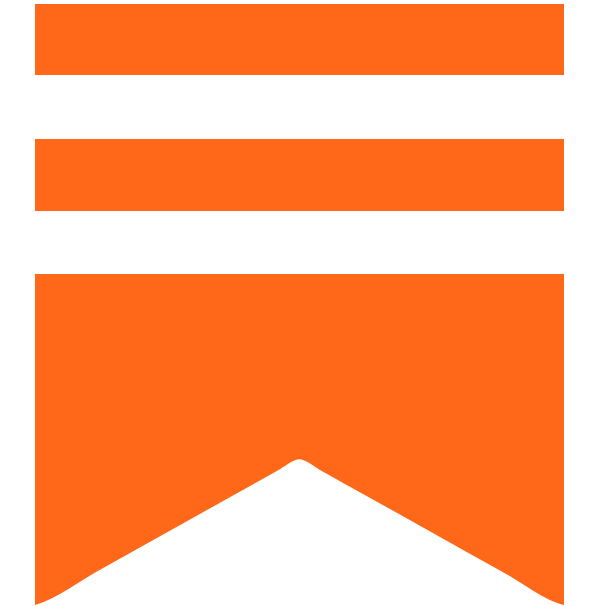

## About Me

⚡ Early-stage WebDev 
 🌠Based in Fortaleza, Brazil
 🔭 Changing career paths
 🧱 Open-source enthusiast
 🄠Community-driven
 🌱 Lifelong learner
 🵠Indie, alternative rock, & lo-fi

##  Socials

 
&nbsp;&nbsp;
&nbsp;&nbsp;
&nbsp;&nbsp;
&nbsp;&nbsp;
&nbsp;&nbsp;
&nbsp;&nbsp;
&nbsp;&nbsp;
&nbsp;&nbsp;
&nbsp;&nbsp;
&nbsp;&nbsp;
&nbsp;&nbsp;

Wanna have a quick chat about anything?  
Just reach out for a [coffee chat ☕](https://cal.com/rafaelbpires/coffeechat)

##  Tech Stacks & Tools 

 

## Analytics & Highlights

&nbsp;
&nbsp;
&nbsp;

  

<a href="https://metrics.lecoq.io/insights/bpires" target="_blank" rel="noreferrer"></img></a>

